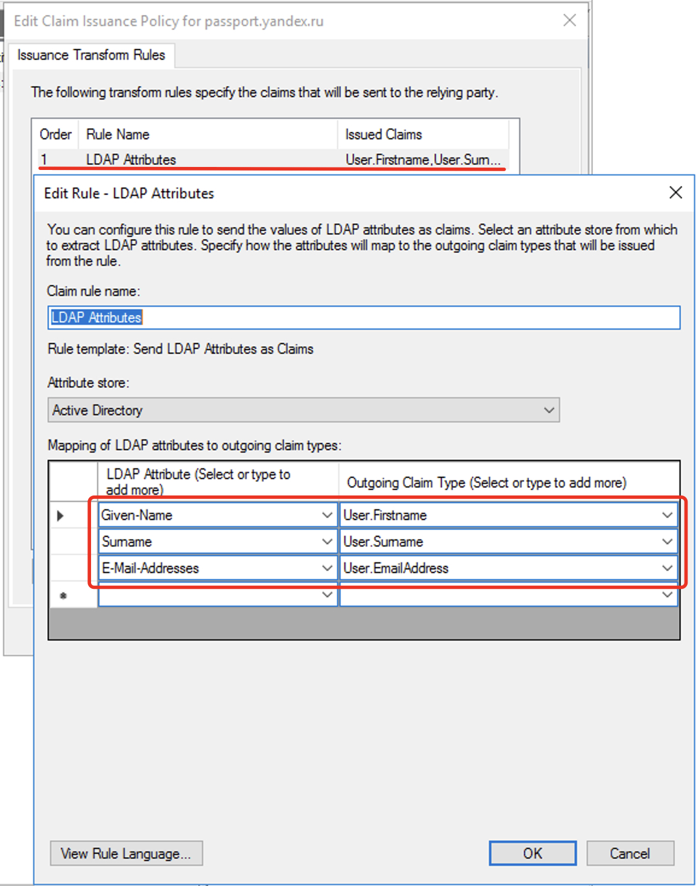
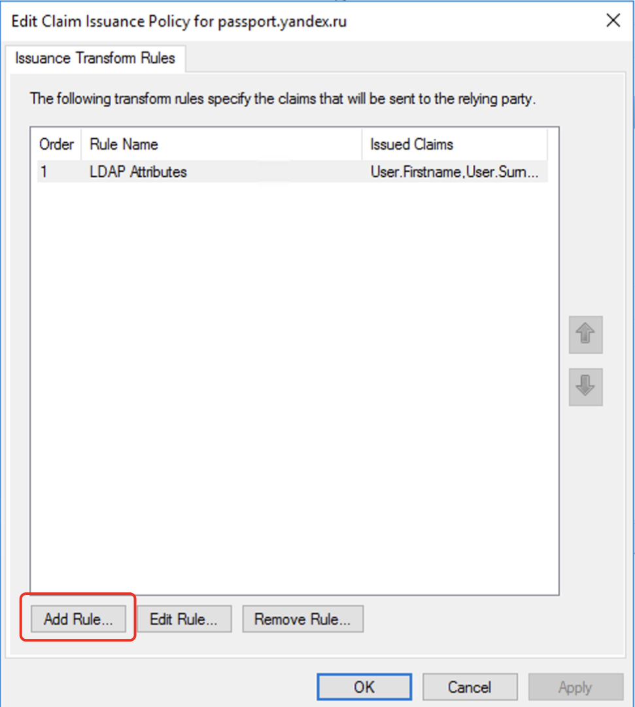
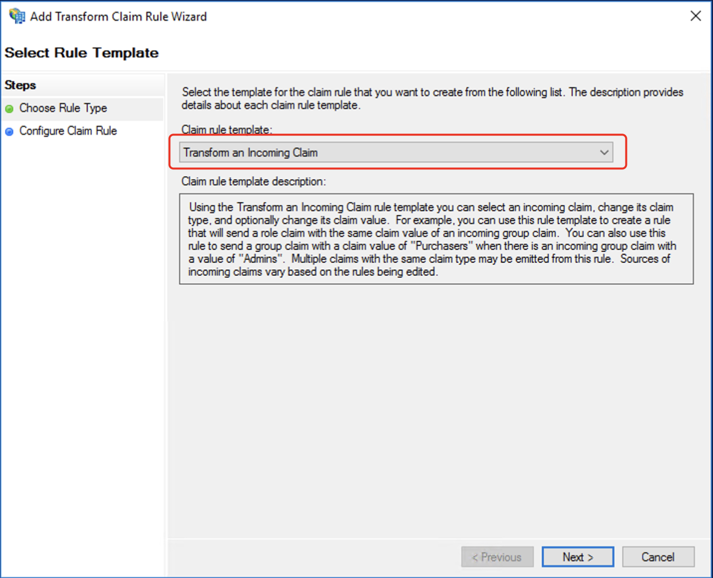
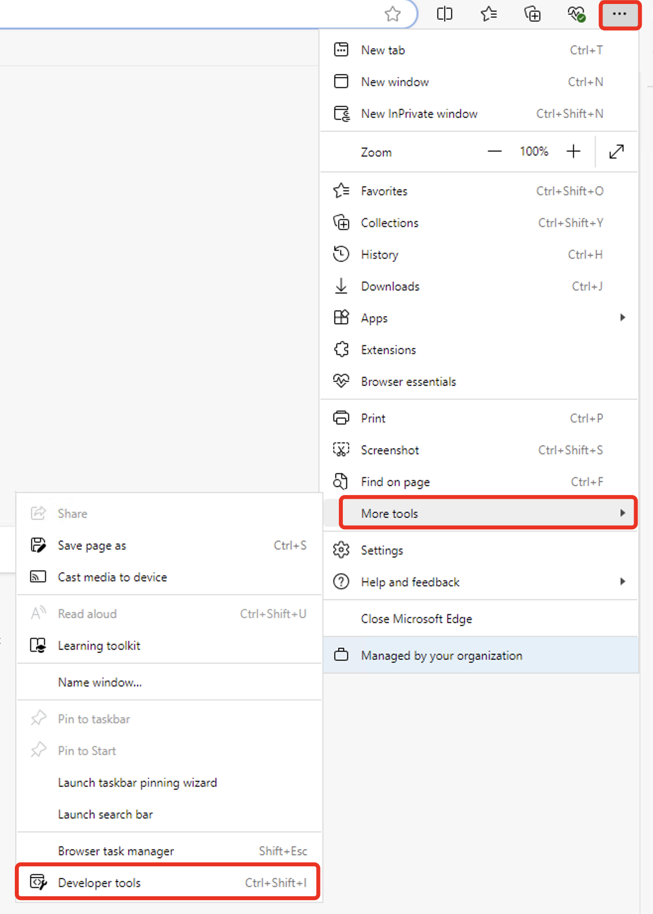
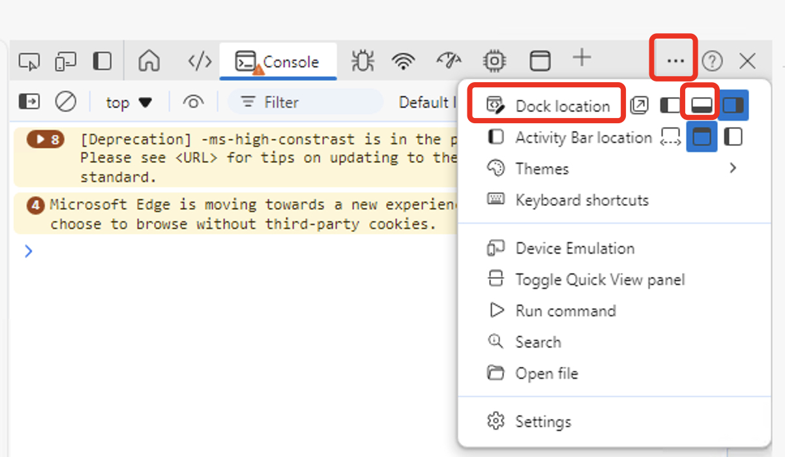
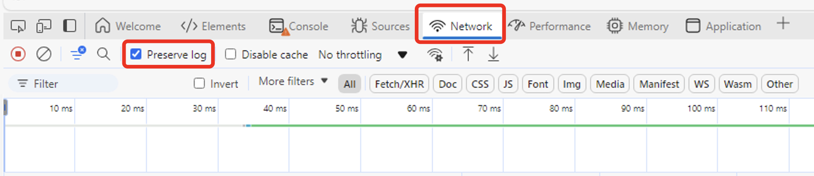
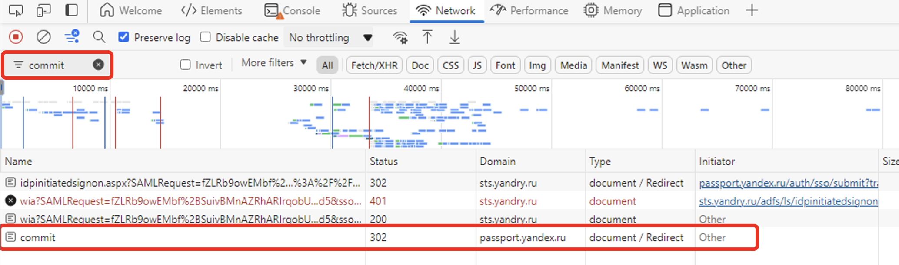
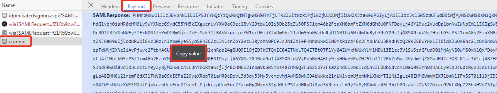
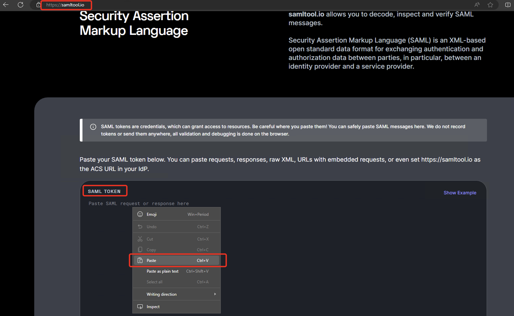
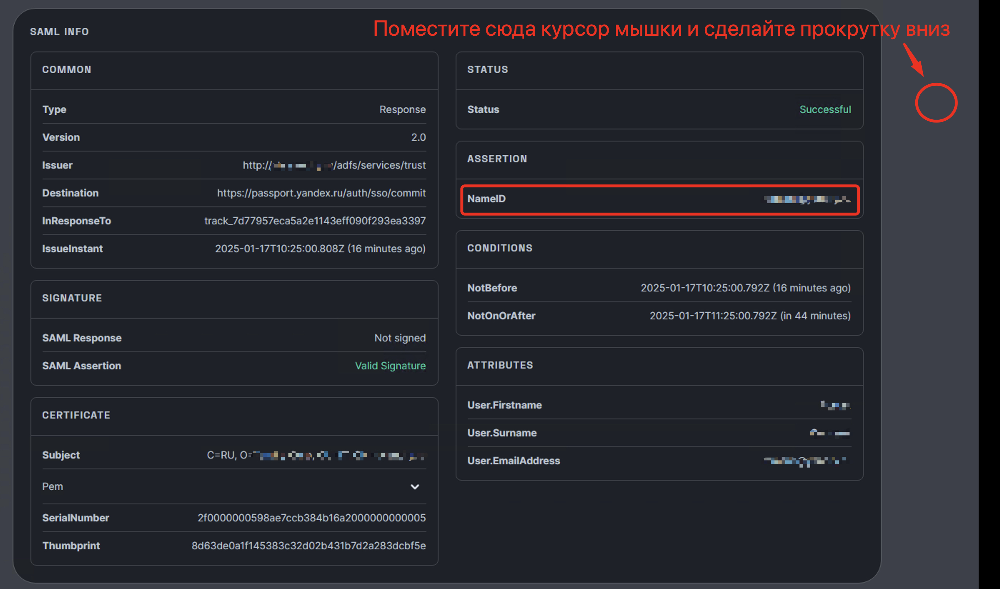

# Назначение модуля.

Проект предназначен для добавления в ADFS возможности передавать в SAMLResponse атрибут ObjectGUID в исходном виде (так как он представляется в Active Directory), а не в виде Base64 строки.  
Исходный код взят из документации для ADFS - (https://learn.microsoft.com/en-us/previous-versions/adfs-2.0/hh599320(v=msdn.10)).  
Технически данный модуль кастомизации ADFS сервера можно расширить для произвольной модификации значений утверждений (claims), т.к. исходный код как раз и показывает, как можно, в частности, манипулировать строками.  
Но в целях безопасности, в предлагеамом модуле в дополнении к трансформации `convertToObjectGUID` рализованы трансформации `toUpper`, `toLower`, `trim`. Также, по сравнению с оригинальным кодом, входящий параметр, который определяет тип запроса/трансформации, перед сравнением со значениями внутри кода приводится к нижнему регистру, чтобы исключить ошибки, которые могут возникнуть в результате вариаций букв нижнего и верхнего регистра при написании правил выпуска утверждений в ADFS сервере.

Как атрибут ObjectGUID отображается в Active Directory:


Пример SAMLResponse, когда значение атрибута ObjectGUID передается ADFS сервером, как есть:  


Пример SAMLResponse, когда значение атрибута ObjectGUID передается ADFS сервером с использованием этой библиотеки:  


## Использование

Вы можете самостоятельно скомпилировать библиотеку в Visual Studio или использовать скомпилированную DLL, расположенную в папке `/dll` для теста и проверки работоспосбности решения.

### Использование готовой DLL.
#### Регисрация библиотеки

> [!WARNING]  
> Для корректной работы данного сценария необходимо в конфигурационном файле утилиты SCIM (автоматическая синхронизация учётных записей из локальной Active Directory в каталог Яндекс 360) установить параметр `IgnoreUsernameDomain` в True. 

- Скачайте скомпилированную DLL из папки `/dll` ([download link](https://raw.githubusercontent.com/alavret/Yandex360/main/ADFS_CustomStore/dll/StringProcessingAttributeStore.dll)) и поместите в корневой каталог сервера ADFS. Для ADFS версии 2016 и выше этот каталог находится по адресу `c:\windows\ADFS\`
- Откройте консоль ADFS сервера и перейдите в раздел `Services -> Attribute Stores` и в панели `Actions` нажмите на `Add Custom Attribute Store`:

 

- Введите название хранилища, по которому вы будете на него ссылаться при написании правил, например, `OriginalObjectGIUD`. Во втором поле укажете информацию, откуда брать код для преобразования в формате `Namespace.ClassName,DllName` (_**обратите внимание, что первым разделителем идёт точка, вторым запятая**_). В случае данной, скомпилированной dll строка будет такой (в этой строке ничего не менять) - `StringProcessingNamespace.StringProcessingClass,StringProcessingAttributeStore`.
  


> [!WARNING]  
> Иногда при добавлении/удалении Custom Attribute Store возникает ошибка. Для продолжения работы перейдите в корень консоли управления ADFS (самый верхний/первый элемент с именем "AD FS") и выберите пункт меню "Action -> Refresh", после чего повторите попытку добавления/удаления.

> [!TIP]  
> Для проверки успешности добавления Custom Attribute Store обратитесь к системному журналу Event Viewer. Выберите `Application and Services Logs -> ADFS -> Admin` и найдите событие с Event ID = 251.

>

>Также с помощью записей в этом логе можно диагностировать ошибки при написании своих собственных функциций преобразования утверждений в ADFS сервере через механизм подключаемых Custom Attribute Store (выполнять отладку кода в библиотеке).

#### Создание првил

Подключёный модуль выполняет трансформацию запрошенного утверждения (claim). Сама трансформация происходит в правилах конвеера управления утверждениями, каждое из которых отвечает за один этап работы или одну трансформацию с запрошенным утверждением. Правила обрабатываются по очереди сверху вниз.

Создадим правила для передачи в SAMLResponse оригинального ObjectGUID. 

Для выбранного приложения в разделе `Ralying Party Trust` (у меня используется passport.yandex.ru) в панели `Actions` активируйте `Edit Claim Insurance Policy`:


> [!WARNING]  
> Обратите внимание, что синтаксис правил ADFS чувствителен к регистру. Особенно это может проявляться при написании типов утверждений, в которых находятся данные для трасформаций. Например, строки с типом `types = ("objectGUID")` и `types = ("ОbjectGUID")` ссылаются на **два** разных утверждения. При отсутствии значения запрошенного утверждения в выводе SAMLResponse проверяйте регистр букв в правилах!

> [!WARNING]  
> Предварительно убедитесь, что в первом правиле (которое было настроено по документации Яндекс 360) отсуствует строка, где выпускается Claim с именем NameID (обычно это 4 строка в списке). Если она есть, удалите ее. Правило должно выглядеть так:
> 

Для создаения правил нажимаем на кнопку `Add Rule` и затем в появившемся мастере выбираем пункт `Send Claims using Custom Rule`. Затем нажимаем `Next` и вводим имя правила (по желанию) и текст правила (необходимо вставлять точный текст).




Создаем два вспомогательных правила для добавления двух типов утверждений.

- Правило с именем `Add ObjectGUID` с содержимым:

> Это правило ищет в каталоге LDAP значение атрибута `ObjectGUID` для пользователя, который выполнил аутентификацию через ADFS сервер. Значение этого атрибута в формате Base64 строки добавлется в список существующих утверждений в виде нового типа утверждения - `types = ("objectGUID")`.

```
c:[Type == "http://schemas.microsoft.com/ws/2008/06/identity/claims/windowsaccountname", Issuer == "AD AUTHORITY"]
 => add(store = "Active Directory", types = ("objectGUID"), query = ";objectGUID;{0}", param = c.Value);
```


- Правило с именем `Add origObjectGUID` с содержимым:

> Это правило выполняет трансформацию полученного на предыдущем этапе значения ObjectGUID в формате Base64 в формат строкового представления байтового массива с использованием нашей подключаемой скомпилированной библиотеки (`Custom Attribute Store`). Вызываемая функция - `convertToObjectGUID`.

```
c:[Type == "objectGUID"]
 => add(store = "OriginalObjectGIUD", types = ("origObjectGUID"), query = "convertToObjectGUID", param = c.Value);
```


Таким образом, после выполнения этого шага у нас появится ёще одно утверждение с типом `types = ("origObjectGUID")`, которое будет содерждать оригинальное значение ObjectGUID пользователя из нашей Active Directory.


Теперь мы можем создать третье правило (ниже по списку после предыдущих двух), которое будет выпускать нужное нам утверждение, используя в качестве значения содержимое утверждения с типом `types = ("origObjectGUID")`.  
Например, если мы хотим выпустить утверждение NameID с этим значением, мы можем сделать следующим образом:

- нажимаем на кнопку `Add Rule` и затем в появившемся визарде выбираем пункт `Transform an Incomming Claim`. Нажимаем `Next`.



- вводим имя правила, например `Issue NameID`, затем в поле `Incomming Claim Type` _**с клавиатуры печатаем**_ (в списке этого значения нет) `origObjectGUID`, в поле `Outgoing Claim Type` _**НЕ печаетаем с клавиатуры, а обязательно выбираем мышкой из списка**_ пункт `Name ID`. Больше ничего не меняем в данном окне и нажимаем кнопку `Finish`.

> [!CAUTION]
> Параметр `Name ID` нужно обязательно выбрать мышкой из списка. При вводе этой строки с клавиатуры решение не заработает. Это наиболее встречаемая ошибка при настройке решения.


Можно проверить, что правило было создано правильно с помощью кнопки `Edit Rule` для этого правила и в появившемся окне просмотра кода правила с помощью кнопки `View Rule Language`. Оно должно быть таким:

```
c:[Type == "origObjectGUID"]
 => issue(Type = "http://schemas.xmlsoap.org/ws/2005/05/identity/claims/nameidentifier", Issuer = c.Issuer, OriginalIssuer = c.OriginalIssuer, Value = c.Value, ValueType = c.ValueType, Properties["http://schemas.xmlsoap.org/ws/2005/05/identity/claimproperties/format"] = "urn:oasis:names:tc:SAML:1.1:nameid-format:unspecified");
```

В результате выполненных операций вы должны иметь три дополнительных правила и при запросе ADFS получите SAMLResponse, показанный в начале статьи.


## Как проверить, что решение работает.

Для проверки работоспособности решения запускаем браузер (для гарантированного перехода на страницу ADFS браузер нужно запускать в рехиме Incognito/InPrivate). Превентивно открываем для этой странички консоль разработчика.
В Chrome и Edge это можно сделать через открытие меня браузера (три точки вверху справа), перехода в раздел "More tools" и далее "Developer Tools". Для Windows данное окно можно открыть, нажав `F12`



Как правило, консоль разработчика открывает справа от основного окна браузера, для удобства дальнейшей работы переместите окно разработчика вниз экрана. Это можно сделать с помощью вот этой кнопки:



После этого перейдите в консоли разрабтчика в раздел `Network` и установите параметр `Preserve Logs`:



Далее выполняем процесс тестового входа.
Переходим на сраницу аутентификации в Яндекс 360 (например, https://mail.yandex.ru), вводим свои учётные данные. Система аутентификации Яндекс Паспорт перенаправит нас на ваш ADFS сервер.
Далее выполняем процедуру аутентификации на странице входа ADFS (вводим идентификатор пользователя и пароль). 
После редиректа с ADFS сервера дожидаемся загрузки страницы, независимо от того, прошёл вход в Яндекс 360 или возникла ошибка. 

Теперь ищем нужный HTTP пакет, который содержит SAMLRespose от ADFS сервера. Для этого в консоли разработчика в сетевом трейсе ищем пакет `commit`. Для этого в строке фильтра вводим эту строку и выделяем мышкой четвёртый найденный пакет в трассировке.



После выделения нужно пакета в интерфейсе справа ищем раздел `Response` и активируем его. В нижней части окна появляется содержимое SAMLResponse. Щелкаем по любому месту этой строки правой клавишей мышки и выбираем пункт `Copy Value`.



Открываем новую вкладку браузера и переходим по адресу https://samltool.io. Листаем содержимое страницы чуть ниже и вставляем в окно `SAML Token` содержимое буфера обмена.



> [!NOTE]
> Содержимое SAML Response не содержит никакой информации о пароле пользователя. Как правило, в нем есть контактная информация о пользователе - его имя входа, почта, ФИО. Сайт samltool.io принадлежит достаточно большой и известной компании Okta, но вы самостоятельно должны принять решение, хотите ли пользоваться услугами этого сайта и анализировать в нем содержимое вашего пакета. В случае работы с тестовыми учетками анализ данных на этом сайте с целью траблшутинга представляется целесообразным и безопасным.
> Вы можете расшифровать содержимое SAMLResponse из Base64 в буфере обмена с помощью локальных плагинов/библиотек и затем отформатировать получившийся XML для более удобного чтения. 

Окно анализа SAML Resonse содержит несколько окон с различным форматом предоставления информации. Для быстрого анализа предлагается воспользоваться самым нижним разделом:



Здесь перечислены все нужные параметры для быстрого траблшутинга, в том числе, параметр `NameID`. Проверьте его правильность и откорректируйте правила выпуска Claims в ADFS сервере.

> [!NOTE]
> Если параметр `NameID` в SAML Response отсутствует, то в большинстве случаев это причина неправильной отработки или ошибки в правилах, которые ответственны за выпуск claims, которые используются затем в `NameID`. 
> Ёще раз удостоверьтесь, что в последнем правиле, где по этой инструкции вы выпускаете `Name ID`, имя этого параметра было введено путём выбора мышкой из предлагаемого списка, а не напечатано с помощью клавиатуры.

