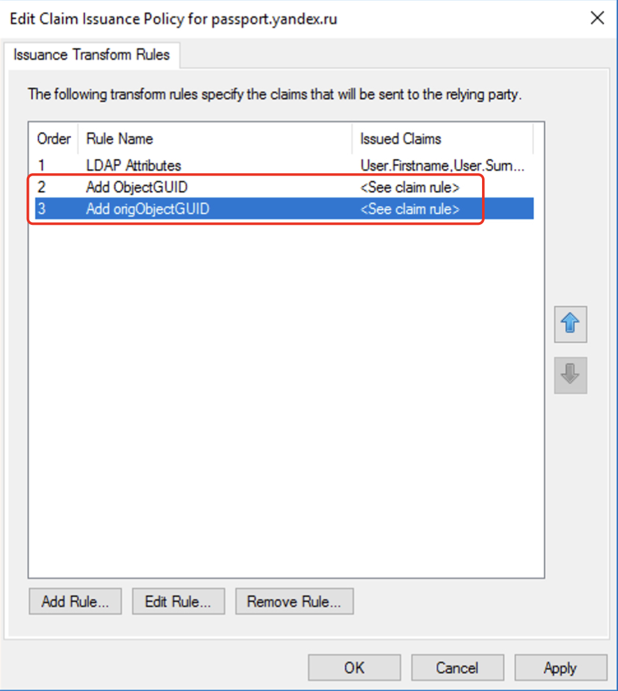

# Назначение модуля.

Проект предназначен для добавления в ADFS возможности передавать в SAMLResponse атрибут ObjectGUID в исходном виде (так как он представляется в Active Directory), а не в виде Base64 строки.  
Исходный код взят из документации для ADFS - (https://learn.microsoft.com/en-us/previous-versions/adfs-2.0/hh599320(v=msdn.10)).  
Технически данный модуль кастомизации ADFS сервера можно расширить для произвольной модификации значений утверждений (claims), т.к. исходный код как раз и показывает, как можно, в частности, манипулировать строками.  
Но в целях безопасности, в предлагеамом модуле в дополнении к трансформации `convertToObjectGUID` рализованы трансформации `toUpper`, `toLower`, `trim`. Также, по сравнению с оригинальным кодом, входящий параметр, который определяет тип запроса/трансформации, перед сравнением со значениями внутри кода приводится к нижнему регистру, чтобы исключить ошибки, которые могут возникнуть в результате вариаций букв нижнего и верхнего регистра при написании правил выпуска утверждений в ADFS сервере.

Как атрибут ObjectGUID отображается в Active Directory:


Пример SAMLResponse, когда значение атрибута ObjectGUID передается ADFS сервером, как есть:  


Пример SAMLResponse, когда значение атрибута ObjectGUID передается ADFS сервером с использованием этой библиотеки:  


## Использование

Вы можете самостоятельно скомпилировать библиотеку в Visual Studio или использовать скомпилированную DLL, расположенную в папке `/dll` для теста и проверки работоспосбности решения.

### Использование готовой DLL.

1.  DLL была скомпилирована для .Net Framework версии 4.8. Проверьте, что на вашем ADFS сервере установлена данная версия, иначе работоспосбность решения не гарантируется.
2.  Скачайте скомпилированную DLL из папки `/dll` ([download link](https://raw.githubusercontent.com/alavret/Yandex360/main/ADFS_CustomStore/dll/StringProcessingAttributeStore.dll)) и поместите в корневой каталог сервера ADFS. Для ADFS версии 2016 и выше этот каталог находится по адресу `c:\windows\ADFS\`
3.  Откройте консоль ADFS сервера и перейдите в раздел `Services -> Attribute Stores` и в панели `Actions` нажмите на `Add Custom Attribute Store`:

 

1.  Введите название хранилища, по которому вы будете на него ссылаться при написании правил, например, `OriginalObjectGIUD`. Во втором поле укажете информацию, откуда брать код для преобразования в формате `Namespace.ClassName,DllName` (_**обратите внимание, что первым разделителем идёт точка, вторым запятая**_). В случае данной, скомпилированной dll строка будет такой (в этой строке ничего не менять) - `StringProcessingNamespace.StringProcessingClass,StringProcessingAttributeStore`.
  


> \[!WARNING\]  
> Иногда при добавлении/удалении Custom Attribute Store возникает ошибка. Для продолжения работы перейдите в корень консоли управления ADFS (самый верхний/первый элемент с именем "AD FS") и выберите пункт меню "Action -> Refresh", после чего повторите попытку добавления/удаления.

> \[!TIP\]  
> Для проверки успешности добавления Custom Attribute Store обратитесь к системному журналу Event Viewer. Выберите `Application and Services Logs -> ADFS -> Admin` и найдите событие с Event ID = 251.


Также с помощью записей в этом логе можно диагностировать ошибки при написании своих собственных функциций преобразования утверждений в ADFS сервере через механизм подключаемых Custom Attribute Store (выполнять отладку кода в библиотеке).

1.  Добавьте правило для передачи в SAMLResponse оригинального ObjectGUID. Для этого:

- Для выбранного приложения в разделе `Ralying Party Trust` (у меня используется passport.yandex.ru) в панели `Actions` активируйте `Edit Claim Insurance Policy`:


> Для того, чтобы выполнить трансформацию нужного утверждения (claim), его нужно добавить в конвеер управления утверждениями. Для этого необходимо добавить правила, каждое из которых отвечает за один этап работы с запрошенным утверждением. Правила обрабатываются по очереди сверху вниз.

> \[!WARNING\]  
> Обратите внимание, что синтаксис правил ADFS чувствителен к регистру. Особенно это может проявляться при написании типов утверждений, в которых находятся данные для трасформаций. Например, строки с типом `types = ("objectGUID")` и `types = ("ОbjectGUID")` ссылаются на **два** разных утверждения. При отсутствии значения запрошенного утверждения в выводе SAMLResponse проверяйте регистр букв в правилах!

Для создаения правил нажимаем на кнопку `Add Rule` и затем в появившемся визарде выбираем пункт `Send Claims using Custom Rule`. Затем нажимаем `Next` и вводим имя правила (по желанию) и текст правила (необходимо вставлять точный текст).


Создаем два вспомогательных правила для добавления двух типов утверждений.

- Правило с именем `Add ObjectGUID` с содержимым:

> Это правило ищет в каталоге LDAP значение атрибута `ObjectGUID` для пользователя, который выполнил аутентификацию через ADFS сервер. Значение этого атрибута в формате Base64 строки добавлется в список существующих утверждений в виде нового типа утверждения - `types = ("objectGUID")`.

```
c:[Type == "http://schemas.microsoft.com/ws/2008/06/identity/claims/windowsaccountname", Issuer == "AD AUTHORITY"]
 => add(store = "Active Directory", types = ("objectGUID"), query = ";objectGUID;{0}", param = c.Value);
```


- Правило с именем `Add origObjectGUID` с содержимым:

> Это правило выполняет трансформацию полученного на предыдущем этапе значения ObjectGUID в формате Base64 в формат строкового представления байтового массива с использованием нашей подключаемой скомпилированной библиотеки (`Custom Attribute Store`). Вызываемая функция - `convertToObjectGUID`.

```
c:[Type == "objectGUID"]
 => add(store = "OriginalObjectGIUD", types = ("origObjectGUID"), query = "convertToObjectGUID", param = c.Value);
```


Таким образом, после выполнения этого шага у нас появится ёще одно утверждение с типом `types = ("origObjectGUID")`, которое будет содерждать оригинальное значение ObjectGUID пользователя из нашей Active Directory.



Теперь мы можем создать третье правило (ниже по списку после предыдущих двух), которое будет выпускать нужное нам утверждение, используя в качестве значения содержимое утверждения с типом `types = ("origObjectGUID")`.  
Например, если мы хотим выпустить утверждение NameID с этим значением, мы можем сделать следующим образом:

- нажимаем на кнопку `Add Rule` и затем в появившемся визарде выбираем пункт `Transform an Incomming Claim`. Нажимаем `Next`.


- вводим имя правила, например `Issue NameID`, затем в поле `Incomming Claim Type` _**с клавиатуры печатаем**_ (в списке этого значения нет) `origObjectGUID`, в поле `Outgoing Claim Type` выбираем из списка `Name ID` (_**помним о зависимости типа утверждения от регистра**_). Больше ничего не меняем в данном окне и нажимаем кнопку `Finish`.


Можно проверить, что правило было создано правильно с помощью кнопки `Edit Rule` для этого правила и в появившемся окне просмотра кода правила с помощью кнопки `View Rule Language`. Оно должно быть таким:

```
c:[Type == "origObjectGUID"]
 => issue(Type = "http://schemas.xmlsoap.org/ws/2005/05/identity/claims/nameidentifier", Issuer = c.Issuer, OriginalIssuer = c.OriginalIssuer, Value = c.Value, ValueType = c.ValueType, Properties["http://schemas.xmlsoap.org/ws/2005/05/identity/claimproperties/format"] = "urn:oasis:names:tc:SAML:1.1:nameid-format:unspecified");
```

В результате выполненных операций вы должны иметь три дополнительных правила и при запросе ADFS получите SAMLResponse, показанный в начале статьи.


