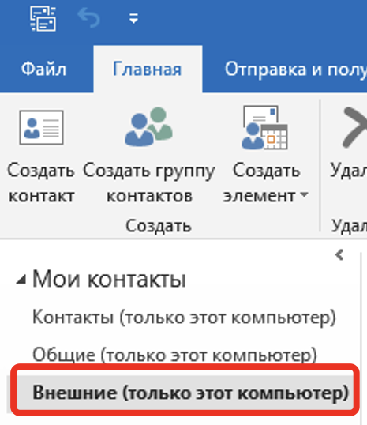
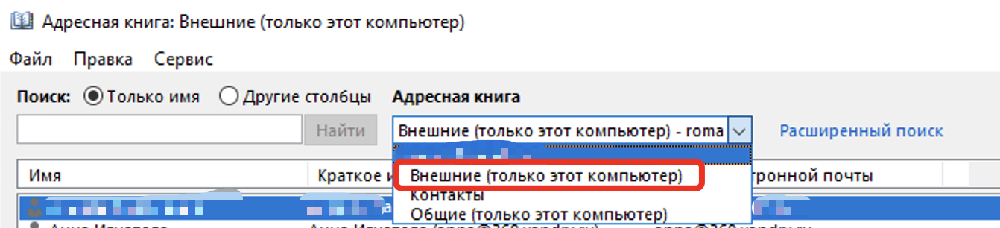

# Работа с адресной книгой в Outlook при подключении к Яндекс 360.
При настройке Outlook на работу с почтой Яндекс 360 необходимо учитывать факт, что подключение к почтовом серверу Яндекс 360 происходит по протоколам IMAP/SMTP, которые позволяют синхронизирвать в профиль Outlook только почтовые сообщения. Синхронизация данных календаря или адресной книги должна проводится другими средствами/протоколами, что приводит к необходимости дополнительной настройки как клиента, так и сервиса Яндекс 360. 
Яндекс 306 позволяет запросить календарную информацию по протоколу CalDAV, а информацию адресной книги - по протоколу CardDav. Реализация обоих протоколов в клиенте MS Outlook отсутствует, поэтому необходимо использовать дополнительное программное обеспечение, которое в виде add-on добавляет в Outlook необходимый функционал.
Кроме того, необходимо дополнительно настроить репликацию контактных данных пользователей в Яндекс 360 для формирования глобального списка адресов, который в дальнейшем будет загружаться по протоколу CardDAV в Outlook и предоставляться пользователям в виде адресной книги.
## Настройка загрузки списка контактов для GAL
### Почему это необходимо делать
Каждой учётной записи, реплицированной в каталог Яндекс 360 автоматически выдаётся лицензия на право работы с сервисами Яндекс 360 (нет возможности отреплицировать всех сотрудников и лишь части из них назначить лицензии). По умолчанию, только учётные записи, которые были отреплицированы в Яндекс 360 будут формировать общую  адресную книгу, которая и будет загружаться в Outlook по протоколу CardDAV.
Поэтому для гибрида (когда лишь часть пользователей работают с почтой Яндекс 360) как workaround предлагается в качестве глобального адресного списка использовать в Почте Яндекс 360 сущность "Внешние контакты", куда можно отреплицировать контактную информацию из всех почтовых учеток Active Directory и синхронизировать этот список в качестве адресной книги в Outlook.
### Реализация на стороне Яндекс 360
Для автоматического создания списка адресной книги необходимо воспользоваться возможностью утилиты [SCIM](https://yandex.ru/support/yandex-360/business/admin/ru/sso/scim). Ее можно настроить на репликацию контактной информации, которая попадёт в список "Внешние контакты" в Яндекс 360.
> [!NOTE]  
> Предполагается, что утилита SCIM установлена и уже синхронизирует пользователей из локальной Active Directory в Яндекс 360. Такие пользователи отображаются в Web интерфейсе в разделе Контакты в списке "Общие контакты":
> 
>
> В Outlook после синхронизации Яндекс коннектором эти пользователи попадают в адресную книгу "Общие (только этот компьютер)":
>
> 
В настройках конфигурации утилиты SCIM есть раздел, посвящённый репликации контактной информации в раздел "Внешние контакты" (пункт 2.10, 2.11 в [справке](https://yandex.ru/support/yandex-360/business/admin/ru/sso/scim)). При этом есть возможность указать отдельный LDAP фильтр для этой репликации.
Файл конфигурации утилиты SCIM располагается по адресу `C:\ProgramData\Yandex\YandexADSCIM\AD_Users.config`. Пример конфигурации может выглядеть таким образом (блок, описывающий репликацию внешних контактов):
```
EnableContacts = True
ContactsFilter =  (|(memberOf=CN=Yandex360Contacts,OU=Groups,OU=Office,DC=domain,DC=tld)(msExchRecipientDisplayType=1)(msExchRecipientDisplayType=3))

PropertyContactFirstName = extensionAttribute4
PropertyContactLastName = displayName
PropertyContactTitle = title
PropertyContactDepartment = department
PropertyContactCompany = company
PropertyContactMail = mail
PropertyContactWorkPhone = telephoneNumber
PropertyContactMobile = mobile
PropertyContactAddress2 = l
```
#### Пояснения
- LDAP фльтр может быть любым. В данном случае, используется запрос, позволяющий реплицировать пользователей определённой группы, плюс информацию о группах рассылки Exchange (msExchRecipientDisplayType=1) и динамических группах рассылки Exchange (msExchRecipientDisplayType=3).
- `PropertyContactLastName = displayName`. В сервисах Яндекс 360 для отображения полного имени пользователя используется определённая логика объединения полей контактной информации (при этом такая логика может отличаться для разных сервисов Яндекс 360). Чтобы не зависеть от этой логики и реализовать корпоративный стандарт именования пользователей, предлагается в один из атрибутов (`PropertyContactFirstName`, `PropertyContactMiddleName`, `PropertyContactLastName`) передать атрибут `displayName` из локальной Active Directory. В данном примере используется атрибут `PropertyContactLastName`.
- строка `PropertyContactFirstName = extensionAttribute4` нужна для того, чтобы заполнить пустым значением атрибут `PropertyContactFirstName`. Если просто закомментировать эту строку, SCIM утилита автоматически начнёт реплицировать в этот атрибут значение поля `givenName` учетной записи в локальной AD.
- `PropertyContactDepartment = department` - обратите внимание, что для внешних контактов есть возможность отреплицировать значение атрибута `Department`, такая возможность отсутствует для учётных записей, которые реплицируются как обычные пользователи в Яндекс 360.
> [!NOTE]  
> Если вы вначале реплицировали во внешние контакты поля в соответствии с конфигурацией по умолчанию (имя, отчество, фамилия каждое в свой собственный атибут в Яндекс 360):
> ```
>PropertyContactFirstName = givenName
>PropertyContactMiddleName = middleName
>PropertyContactLastName = sn
>```
>а затем было принято решение использовать схему с `displayName` только в один атрибут
>```
>PropertyContactFirstName = extensionAttribute4
>PropertyContactLastName = displayName
>```
>может произойти ситуация, когда после новой репликации один из атрибутов `PropertyContactFirstName`, `PropertyContactMiddleName`, `PropertyContactLastName` сохранит своё старое значения, хотя вы в настройках SCIM настроили передачу в этот атрибут поля в AD с пустым значением (например, `extensionAttribute4`). В таком случае, необходимо в этот атрибут (`extensionAttribute4`) записать один пробел, так как система в некоторых случаях не принимает к изменению поле, в котором нет значения (пустая строка). 
>[!IMPORTANT]
> В качестве напоминания. При реализации гибрида Яндекс 360 и локального почтового сервера (например, Exchange), когда MX домена пользователя ли группы смотрит на землю, все письма, на этот домен технически уходят на соответствующий MX.
> Например, у группы адрес `group1@contoso.com`. Этот домен добавлен в организацию Яндекс 360, но его MX смотрит на локальный Exchange. При отправке польователем Яндекс 360 письма на эту группу оно уйдёт в локальный Exchange, там эта группа будет раскрыта (извлечены её члены) и уже Exchange будет самостоятельно рассылать письма всем раскрытым членам этой группы. 
В Web интерфейсе контакты списка `Внешние контакты` появятся в списке `Общие контакты`.
## Реализация в Outlook
Для возможности синхронизации контактов в Outlook необходимо установить addon [Яндекс Коннектор для Microsoft Outlook](https://yandex.ru/support/yandex-360/business/calendar/ru/plug-in).
После аутентификации в Коннекторе он автоматически будет синхронизировать как календарную информацию, так и контактные данные, в том числе адресную книгу `Внешние контакты` (настройки можно помениять).

