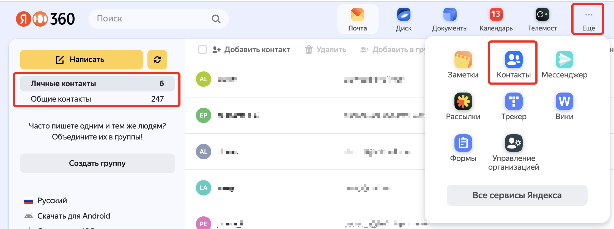
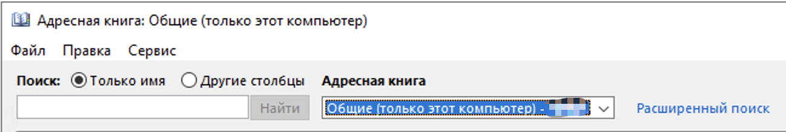

# Работа с адресной книгой в Outllok при подключении к Яндекс 360.
При настройке Outlook на работу с почтой Яндексч 360 необходимо учитывать факт, что подключение к почтовом серверу Яндекс 360 происходит по протоколам IMAP/SMTP, которые позволяют синхронизирвать в профиль Outlook только почтовые сообщения. Синхронизация данных календаря или адресной книги должна проводится другими средствами/протоколами, что приводит к необходимости дополнительной настройки как клиента, так и сервиса Яндекс 360. 
Яндекс 306 позволяет запросить календарную информацию по протоколу CalDAV, а информацию адресной книги - по протоколу CardDav. Реализация обоих протоколов в клиенте MS Outlook отсутствует, поэтому необходимо использовать дополнительное программное обоеспечение, которое в виде addon добавляет в Outlook необходимый функционал.
Кроме того, необходимо дополнительно настроить репликацию контактных данных пользователей в Яндекс 360 для формирования глобального списка адресов, который в дальнейшем будет загружаться по протоколу CardDAV в Outlook.
## Настройка загрузки списка контактов для GAL
### Почему это необходимо делать
Каждой учётной записи, реплицированной в каталог Яндекс 360 автоматически выдаётся лицензия на право работы с сервисами Яндекс 360 (нет возможности отреплицировать всех сотрудников и лишь части из них назначить лицензии). По умолчанию, только учётные записи, которые были отреплицированы в Яндекс 360 будут формировать общую  адресную книгу, которая и будет загружаться в Outlook по протоколу CardDAV.
Поэтому для гибрида в качестве workaround предлагается в качестве глобального адресного списка использовать в Почте Яндекс 360 сущность "Внешние контакты", куда можно также отреплицировать контактную информацию из учеток Active Directory и синхронизировать этот список в качестве адресной книги в Outlook.
### Реализация на стороне Яндекс 360
Для автоматического создания списка адресной книги необходимо воспользоваться возможностью утилиты [SCIM](https://yandex.ru/support/yandex-360/business/admin/ru/sso/scim?ysclid=m5ux7hg3m0838872341), которую можно настроить на репликацию контактной информации, которая попадёт в список "Внешние контакты" в Яндекс 360.
> [!NOTE]  
> Предполагается, что утилита SCIM установлена и уже синхронизирует пользователей из локальной Active Directory в Яндекс 360. Такие пользователи отображаются в Web интерфейсе в разделе Контакты в списке "Общие контакты":
> 
>
> В Outlook после синхронизации Яндекс коннестором эти пользователи попадают в адресную книгу "Общие (только этот компьютер)":
>
> 
