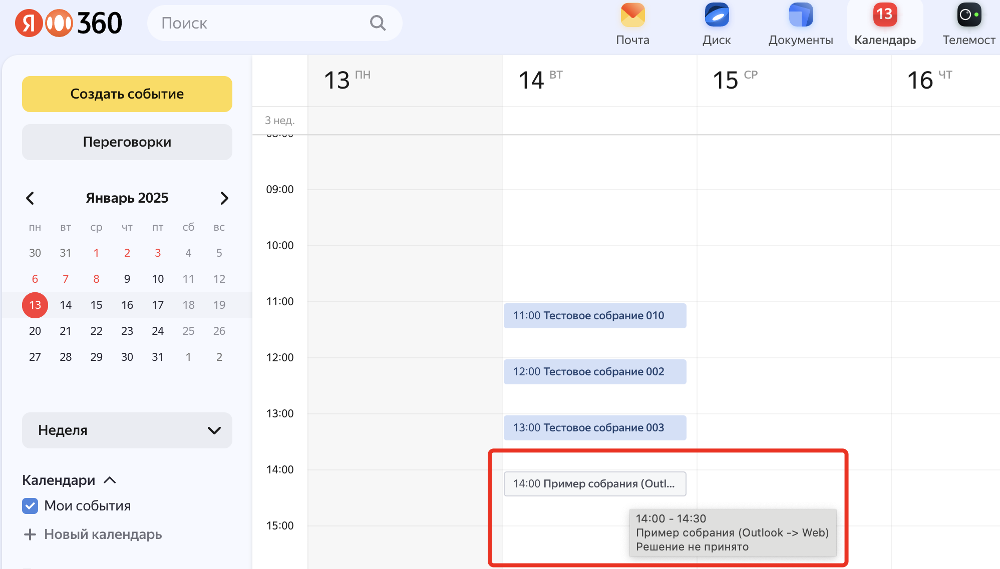
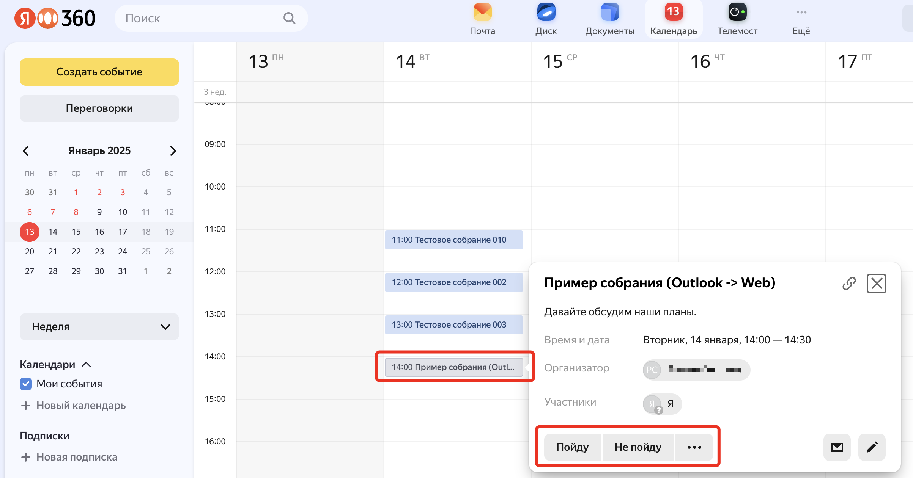
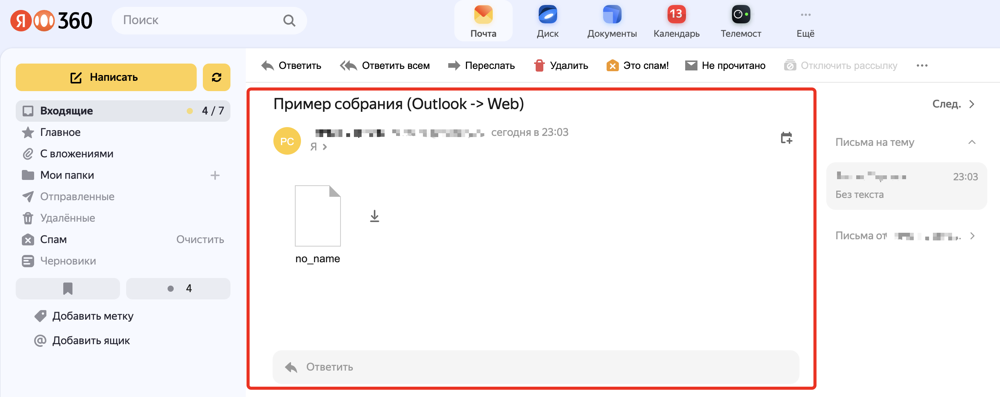

# Особенности работы в гибриде (ящики организации в Яндекс 360 и в локальном Exchange) из клиента Outlook
> [!NOTE]
> Предполагается, что перед изучением данной статьи был прочитан материал [Гибридный режим работы Яндекс 360 и локальной почтовой системы (Exchange)](HybridEssentials.md).
> В нем, в частности, обсуждается вопрос организации работы Outlook с Календарём Яндекс 360.
## Взаимодействие между клиентами Outlook, подключёнными к разным почтовым системам
### Почтовый трафик
Почтовый трафик при правильной настройке маршрутизации сообщений основного и сервисного домена, а также сооветствующих исключений в антиспам системах ходит без проблем.
Если пользователю оставили старый ящик в локальной системе и создали новый в Яндекс 360, затем в локальной системе настроили правила форвардинга сообщений с их копированием в основной ящик, то у пользователя будет два идентичных ящика, с каждого из которых он может писать письма любому пользователю организации и в Интернет. Единственное ограничение - папка "Отправленные"/"Sent Items", т.к. отправленные письма хранятся в той почтовой системе, к которой был подключен клиент, из которого было отправлено письмо. Содержимое этих IMAP папок будет различно в двух почтовых ящиках.
### Календарная информация
> [!IMPORTANT]
> И Outlook и Яндекс 360 Календарь работают с календарными событиями в виде файлов формата ICS. Данный файл передаётся как вложение в обычное SMTP письмо, которое специальным образом парсится почтовым сервером или клиентом и преобразуется в календарное событие. 
>Различие том, как реализуется хранение событий, работа с приглашениями, подтверждениями/отказа от встречи и т.д. И именно здесь проявляются сильные различия между почтовыми системами, в том числе, между Exchange/Outlook и Яндекс 360. И данный факт сильно влияет на пользовательский опыт, т.к. часть операций происходит по другим шаблонам и сценариям. И привести две системы к одному знаменателю нет никакой возможности.

Сценарии обмена календарной информацией, как правило, наиболее проблемная часть гибрида. 

>[!CAUTION] 
> Общие для всех сценариев ограничения.
> 1. В Outlook, подключённый по IMAP к Яндекс 360 недоступен сервис планирования занятости (Scheduling assistant). Этот функицонал работает только в Web интерфейсе сервиса Яндекс 360 Календарь и только с занятостью пользоватлей, у которых есть почтовый ящик в Яндекс 360.
> 2. В Outlook в помощнике по планированию недоступны переговорки, созданные в организации Яндекс 360. Однако переговорные комнаты, как локальные, так и Яндекс 360 можно резервировать через добавление во встречу SMTP адреса переговорки.
> 3. В Outlook нельзя увидеть календарь общего почтового ящикав Яндекс 360 (только его сообщения). Подключить к IMAP профилю Яндекс 360 общий почтовый ящик из локального Exchange также невозможно.
> 4. В Яндекс 360 не поддерживаются события с файлами-вложениями.
> 5. Размер одного события ограничен размером в 25 Мб.

#### Различные аспекты работы с календарными событиями Яндекс 360 в Outlook
Один из "идеальных" сценариев работы с календарями - наличие у взаимодействующих между собой пользователей почтовых ящиков в Яндекс 360 и использование Web интерфейса для работы с календарями. 
Если работа с ящиком в Яндекс 360 происходит через Outlook, то необходимо установить Яндекс Коннектор для Microsoft Outlook. Этот плагин выполняет автоматическую синхронизацию календарной информации из сервиса Яндекс Календарь в локальный профиль Outlook и в обратном направлении (событие, созданное в Web интерфейсе Яндекс 360 Календаря, будет реплицировано в профиль Outlook и наоборот) по протоколу CalDAV.
При этом в Outlook возможна полноценная работа с календарными событиями в Яндекс 360 (содать, принять, отклонить, изменить и т.д.)
Различные отклонения в стандартных шаблонах работы с событиями в Яндекс 360 возникают при некоторых сценариях, когда есть необходимость приглашать во встречи сотрудников с почтовыми ящиками на земле. Как и наоборот, когда локальные пользователи приглашают во встречи участников с почтовыми ящиками а Яндекс 360.
Вот некоторые из особенностей.
1. **При отправке приглашения из Outlook** в Web клиенте почты получателя не будет подробной информации о событии (только кнопки "Принять"/"Отклонить"). Сама информация о событии с возможность принять или отклонить будет доступна в Web интерфейсе сервиса Яндекс 360 Календарь. При обмене календарными событиями между клиентами Outlook такой проблемы нет.
Пример.
Событие, созданное в Outlook, подключённом к Яндекс 360 или локальному Exchange, при отображении в сервисе Яндекс 360 Календарь:

Детали такого события с возможностью Принять/Отклонить:

Как данное событие предствленов Web интерфейсе Яндекс 360 Почта:

Если открыть само такое письмо:

2. Если у пользователя два почтовых ящика (в Exchange и в Яндекс 360), то при создании календарного события в IMAP профиле Яндекс 360 это событие не появится в календаре локального Exchange (в календаре владельца события). Оно будет только в календаре Яндекс 360 и синхронизируемой локальной копии Outlook на локальной машине.
Однако это событие появится в календаре Exchange (так и в календаре Яндекс 360, если в нем есть почтовый ящик) всех приглашённых в собрание (т.к. им на электронную почту придёт письмо с ICS шаблоном события и Outlook сможет его распарсить и добавить с календать почтового ящика Exchange или Яндекс 360).
В зависимости от того, в каком почтовом ящике (Exchange или Яндекс 360) приглашённый во встречу нажмёт кнопку Принять/Отклонить, в зависимости от этого у владельца события будет (или не будет) информация о реакции участника на это событие (и эта информация будет различаться в зависимости от почтового ящика владельца события). Причина - сообщения о реакции на  события в почтовом ящике Exchange считаются отдельным типом MAPI сообщения (не SMTP сообщением), которые не пересылаются по правилам SMTP маршрутизации внутри Exchange и не доходят через правило форвадинга из ящика владельца события в Exchange в ящик владельца в Яндекс 360. Поэтому при таком поведении в ящике владельца события в Яндекс 360 будет непринятое собрание (хотя приглашённый в Exchange ящике нажал на "Принять").
## Просмотр каледарей из Яндекс 360 в Exchange и наоборот.
Простого способа выполнить данную процедуру нет. Календарь Яндекс 360 доступен по протоколу CalDAV, который не понимает ни Outlook ни OWA. Установка Коннектора для Outlook не решает проблему, т.к. таким образом возможно подключиться только к одному календарю.
Один из возможных вариантов решения проблемы - использование шаринга календарей через ICS файл из самого Outlook.
> [!IMPORTANT]
> Специалисты Яндекс 360 не являются специалистами по продуктам Microsoft и не могут давать консультации по их использованию. Далее представлена информация без гарантии её верности и работоспосбности.

Последовательность действий может быть такой (часть шагов с картинками можно посмотреть [тут](https://venue.cloud/help/hosting/WebDAV/outlook-2016-publishing/)):
- заходим в https://id.yandex.ru пользователем почтового ящика и получаем пароль приложения для сервиса WebDAV.
- заходим в Яндекс Диск пользователя через обычного клиента (web или desktop), создаем папку, например, ical).
- Подключаем Outlook с установленным Яндекс Коннектором к Ящику в Яндекс 360.
- Даём возможность синхронизироваться событиям из Яндекс 360 Календаря в локальный кэш Outlook.
- Открываем соответствующий календарь (синхронизированных календарей может быть несколько) и в интерфейсе Outlook ищем кнопку "Опуликовать в Интернете".
- Выполняем заполнение полей, в поле адрес сервера укаываем `https://webdav.yandex.ru/ical` (ical - это созданная ранее папка).

После этого каледарь ящика в Яндекс 360 будет опубликован в Яндекс Диске. Его можно пошарить с другими пользователями, у которых есть Outlook (независимо от ящика подключения).

Такую же операцию можно сделать с каледарем ящика в локальном Exchange и поделиться им с пользователем в Яндекс 360.

Остаётся вопрос, с какой периодичностью будет публиковаться данный календарь, но это уже нужно выяснять опытным путём в конкретной конфигурации.

