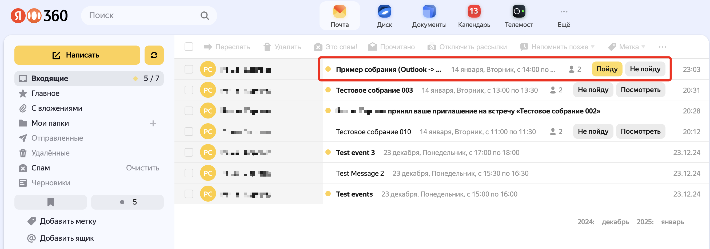

# Особенности работы с каледарными событиями в Outlook в гибридном режиме (Yandex 360 + локальный Exchange)
> [!IMPORTANT]
> Гибридный режим подразумевает использование одного почтового домена для двух различных почтовых систем. При этом пользватели организации распределены между этими почтовыми системами. В случае Яндекс 360 особенностью гибридного режима является MX запись рабочего домена, которая смотрит на "землю" (в локальную почтовую систему, например, в Exchange). 
> При таком режиме все письма на рабочий домен из почтовых ящиков пользователей организации в Яндекс 360 маршрутизируются сразу в локальную систему (по адресу MX), даже если почтовый ящик получателя находится также в Яндекс 360. Далее уже задача транспорта локальной почтовой системы корректно обработать письмо и направить его получателю.
> [!CAUTION]
> **Гибридный режим работы почты официально не поддерживается в Яндекс 360**.
> Если обеспечить корректную маршрутизацию почтовых сообщений между несколькими почтовыми системами, как правило, не представляет проблемы, то обеспечение корректного обмена календарными данными, глобальными адресными книгами, задачами и другой информацией - это большая проблема в связи с наличием различных подходов к форматам такой информации и её обработки.
> Microsoft приложил много усилий для популяризации своего клиента Outlook и подхода к работе с офисной информацией. Но взаимодействие сторонних продуктов с этими форматами и протоколами представляет проблему, т.к. форматы/протоколы являются проприентарными и закрытыми и лишь недавно MS стала публиковать документацию по своим продуктам. В свою очередь, Microsoft лишь частично реализовала в Outlook поддержку стандартных форматов и протоколов, принятых в Internet для работы, например, с календарной информацией.
## Краткая последовательность шагов по реализации гибридного режима работы почтовой системы на стороне локального сервера и Яндекс 360
> [!NOTE]
> Это базовая формула. Варианты реализации различются в зависимости от конфигурации почтового системы конкретной организации.
- Предполагаем, что основной домен организации - `contoso.com`. Пользватели имеют SMTP адреса в этом домене.
- Добавляем в Яндекс 360 данный домен `contoso.com` как основной домен организации.
- Реплицируем выбранных для работы в почте Яндекс 360 пользователей в организацию Яндекс 360 (с использованием утилиты SCIM).
- (Опционально) Реплицируем всех пользователей организации в список "Внешние контакты" для симуляции GAL в почтовых клиентах.
- Настраиваем SAML аутентификацию (например, через ADFS сервер). 
- Выбираем "сервисный" почтовый домен третьего уровня (наример, `360.contoso.com`) и также добавляем его в список доменов организации Яндекс 360.
- (Опционально) Настраиваем политику адресов исходящей почты для пользователей (чтобы у них не было возможности выбирать исходящий домен в настройках почты).
- Добавляем исходящий "белый" IP адрес локальной почтовой системы в "белый список" почтовых серверов для входящего трафика в Яндекс 360.
- Добавляем исходящие SMTP адреса Яндекс 360 в SPF список для основного почтовго домена организации.
- Настраиваем локальный входящий SMTP сервер, выполняющий роль антиспама/антивируса для почтовых сообщений для работы с исходящим SMTP сервером Яндекс 360. С Яндекс 360 (внешней почтовой системе по отношению к локальной системе) будут приходить письма с исходящим адресом в основном домене (user@contoso.com). Для любого антиспама это является признаком нарушения правил и такие письма автоматически блокируются. Необходимо добавить SMTP сервера Яндекс 360 в исключения этого правила. Безопасность при этом не пострадает - у злоумышленника с локальной учеткой в yandex.ru или учеткой в другой организации Яндекс 360 нет возможности отправить письмо от чужого имени/домена.
- Если в локальной организации Exchange, устанавить дополнительные разрешения для сервисного домена в виде команд RemoteDomain:
```
New-RemoteDomain -Name "Yandex 360" -DomainName 360.contoso.com
Set-RemoteDomain -Identity  "Yandex 360" -AutoReplyEnabled $true -AutoForwardEnabled $true -All
owedOOFType InternalLegacy -DeliveryReportEnabled $true -NDREnabled $false -MeetingForwardNotificationEnabled $true
```
- Выбираем вариант миграции почтового ящика из локальной почтовой системы в Яндекс 360:
    - с помощью серверной миграции почтовых ящиков через IMAP протокол;
    - с использованием правил личного почтового почтового ящика (если у пользователя основная почта - `andy@contoso.com`, то нужно создать правило  перенаправления с копированием всех писем на адрес `andy@360.contoso.com`)
    - с использованием опции перенапраления писем на стороне сервера. Например, в Exchange это может быть команда
    ```
    Set-Mailbox -Identity andy -DeliverToMailboxAndForward $true -ForwardingSMTPAddress "andy@360.contoso.com"
    ```
    - В Exchange также есть возможность преобразовать почтовый ящик пользователя в MailEnebledUser объект с внешним адресом `andy@360.contoso.com`. В этом случае, история почтового ящика будет отсутствовать в Яндекс 360.
## Настройка дестопного клиента для работы с почтой Яндекс 360.
С почтой Яндекс 360 можно работать из Web интерфейса, а также из любого почтового клиента, который понимает IMAP/SMTP протокол.
Идеальным вариантом является Thunderbird - он понимает OAuth аутентификацию и имеет встроенную поддержку протоколов CalDAV и CardDAV, понимает автоматическое подключение доступных пользователю общих ящиков.
При использовании клиента Outlook необходимо учитывать следующее:
- автонастройка Outlook (Autidiscovery процесс) для работы с IMAP протоколом возможна, но требует дополнительных усилий по разворачиванию соответствющего Web сервиса на базе Nginx для его реалиазации. 
- каждый пользователь самостоятельно должен получить в Web интерфейсе свой пароль приложений для работы с IMAP/SMTP сервером Яндекс 360. Outlook не умеет использовать OAuth протокол для аутентификации на сторонних IMAP сервисах.
- даже при наличии автонастройки параметров профиля IMAP пользователь должен участвовать в завершении настройки Outlook путём ввода пароля приложения для IMAP, полученным на предыдущем шаге.
- при необходимости подключения дополнительных (общих) ящиков к IMAP профилю пользователя в Outlook для каждого из них необходимо выполнить все настройки подключения вручную (имена серверов, алиас ящика, логин входа и пароль приложения). Сервис автообнаружения для такого сценария не работает.
- после создания профиля для возможности синхронизации в локальный профиль Outlook календарной и контактной информации из Яндекс 360 необходимо установить [Яндекс Коннектор для Microsoft Outlook](https://yandex.ru/support/yandex-360/business/calendar/ru/plug-in) и пройти в нем аутентификацию (процесс требует ввода кода в соответствующее окно лично пользователем).
## Особенности взаимодействия между клиентами Outlook, подключёнными к разным почтовым системам
### Почтовый трафик
Почтовый трафик при правильной настройке маршрутизации сообщений основного и сервисного домена, а также сооветствующих исключений в антиспам системах ходит без проблем.
Если пользователю оставили старый ящик в локальной системе и создали новый в Яндекс 360, и в локальной системе настроили правила форвардинга сообщений с их копированием в основной ящик, то у пользователя имеется два идентичных ящика, с каждого из которых он может писать письма любому пользователю организации и в Интернет. Единственное ограничение - папка "Отправленные"/"Sent Items", т.к. отправленные письма хранятся в той почтовой системе, к которой был подключен клиент, из которого было отправлено письмо.
### Календарная информация
> [!IMPORTANT]
> И Outlook и Яндекс 360 Календарь работают с календарными событиями в виде файлов формата ICS. Данный файл передаётся как вложение в обычное SMTP письмо, которое специальным образом парсится почтовым сервером и преобразуется в календарное событие. 
>Различие в том, как реализуется хранение событий, работа с приглашениями, подтверждениями/отказа от встречи и т.д. И именно здесь проявляются сильные различия между почтовыми системами, в том числе, между Exchange/Outlook и Яндекс 360. И данный факт сильно влияет на пользовательский опыт, т.к. часть операций происходит по другим шаблонам и сценариям. И привести две системы к одному знаменателю нет никакой возможности.

Это наиболее проблемная часть гибрида с наличием сценариев, где в принципе невозможно организовать взаимодействие встроенными (и внешними) средствами.
>[!CAUTION] 
> Общие для всех сценариев ограничения.
> 1. В Outlook, подключённый по IMAP к Яндекс 360 недоступен сервис планирования занятости (Scheduling assistant). Этот функицонал работает только в Web интерфейсе сервиса Яндекс 360 Календарь.
> 2. В Outlook недоступны переговорки, созданные в организации Яндекс 360. Эта возможнось есть только в Web интерфейсе сервиса Яндекс 360 Календарь.
Разберем некоторые сценарии подробнее (все комбинации нет возможности воспроизвести и протестировать).
> 3. В Outlook нельзя увидеть календарь общего почтового ящика (только его сообщения).
> 4. В Яндекс 360 не поддерживаются события с файлами-вложениями.

Разберем несколько наиболее используемых сценариев.
#### Outlook (IMAP 360) <-> Outlook (IMAP 360) <-> Web клиент Яндекс 360 Календарью
Один из "идеальных" вариантов. При установленном Яндекс Коннектор для Microsoft Outlook автоматически происходит синхронизация календарной информации из сервиса Яндекс Календарь в локальный профиль Outlook и в обратном направлении (событие, созданное в Web интерфейсе Яндекс 360 календарь, будет реплицировано в профиль Outlook и наоборот). 
В любом клиенте возможно обработка запроса на встречу (принять, отклонить) с использванием стандартных кнопок.
Но есть несколько особенностей.
1. **При отправке приглашения из Outlook** в Web клиенте почты получателя не будет подробной информации о событии (только кнопки "Принять"/"Отклонить"). Сама информация о событии с возможность принять или отклонить будет доступна в Web интерфейсе сервиса Яндекс 360 Календарь. При работе обмене календарными событиями между клиентами Outlook такой проблемы нет.
Пример.
Событие, созданное в Outlook, подключённом к Яндекс 360 или локальному Exchange, при отображении в сервисе Яндекс 360 Календарь:

Детали такого события:

Принять/отклонить событие:

Как данное событие предствленов Web интерфейсе Яндекс 360 Почта:

Если открыть само такое письмо:


