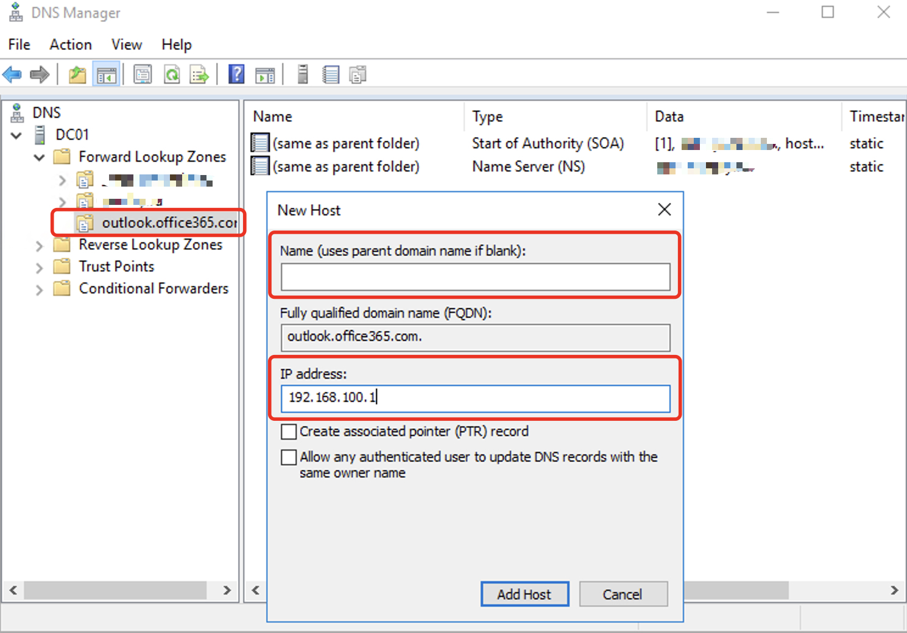

# Описание решения

Решение предназначено для раздачи клиентам MS Outlook параметров IMAP через службу MS Exchange Autodiscovery. Конфигурация, представленная в решении, позволяет настраиваться клиенту Outlook на почтовый ящик IMAP в сервисе Почта Яндекс 360.

### Краткое описание компонентов и логики решения

На хосте с Linux установлен форк Nginx - Openresty (у него встроенная поддержка LUA скриптов), база Redis и среда выполнения Python.

1.  Скрипт Python по расписанию Cron выполняет запросы в контролер домена AD для запроса по протоколу LDAP списка пользователей, ящики которых находятся в Яндекс 360. Почтовые адреса таких пользователей помещаются в базу Redis в ОЗУ.
2.  Клиент Outlook (версии 2016 и выше) при поиске параметров почтового ящика (при настройке профиля) в первую очередь обращается к серверу outlook.office365.com. Nginx/Openresty настраивается на работу от имени этого хоста и перехватывает запросы Outlook. При анализе запроса Openresty ищет информацию о пользователе в базе Redis, и, если находит, возвращает её в виде autodiscover.xml файла с параметрами ящика в IMAP сервере Яндекс 360.
3.  Если пользователь не перемещен в сервис Яндекс 360, то следующий запрос Outlook - в службу Autodiscovery Exchange или по заранее заданной логике с использованием DNS сервиса с получением данным по настройке почтового ящика на работу с локальным сервером (обычно, Exchange)

> [!INFO]  
> Решение с подменой хоста outlook.office365.com вызвано тем, что Nginx не умеет делать Reverse Proxy для Autodiscover и HTTPMapi запросов из-за использования в последних аутентификации NTLM (модуль Nginx для такого сценария есть только в платной версии - Nginx Plus).


## Подготовка к работе

### 1. Создаем учётную запись в локальной Active Directory

Запись нужна для возможности подключения к LDAP каталогу и запросу информации о пользователя по LDAP фильтру. В целях безопасности данная учётная запись должна иметь минимальные права и иметь исключения на периодическую смену пароля.

### 2. Устанавливаем базу Redis

Гайд с установкой Redis под разные OS - [ссылка](https://redis.io/docs/latest/operate/oss_and_stack/install/install-stack/)

Пример для Ubuntu 22.04:

``` bash
sudo apt-get install lsb-release curl gpg
curl -fsSL https://packages.redis.io/gpg | sudo gpg --dearmor -o /usr/share/keyrings/redis-archive-keyring.gpg
sudo chmod 644 /usr/share/keyrings/redis-archive-keyring.gpg
echo "deb [signed-by=/usr/share/keyrings/redis-archive-keyring.gpg] https://packages.redis.io/deb $(lsb_release -cs) main" | sudo tee /etc/apt/sources.list.d/redis.list
sudo apt-get update
sudo apt-get install redis-stack-server
```

Для запуска службы (и постановке её в автозапуск при старте системы) используем команды:

``` bash
sudo systemctl enable redis-stack-server
sudo systemctl start redis-stack-server
```

> [!INFO]  
> Параметры запуска Redis по умолчению достаточны для работы скрипта и безопасны для работы в локальной сети (доступ к базе только с процессов внутри данной локальной машины по адресу 127.0.0.1)

Проверить работоспособность Redis можно, запустив клиентскую утилиту по работе с базой - `redis-cli` и выполнив команду `Ping`, на что система должна выдать ответ - `Pong`  


### 3. Устанавливаем Python и настраиваем окружение для запуска скрипта

>[!WARNING]
> Далее все рекомендации по установке и настройке среды описваются для последней версии Python (протестировано на 3.12.4). Если у вас другая версия, поступайте в соответствии с вашей конфигурацией.

- Необходимо установить исполняемую среду Python ([Download Python](https://www.python.org/downloads/)).

- Cоздать каталог для размещения скрипта и его настроек, перейти в этот каталог.

- (Опциоанально) Использовать виртуальную среду для работы программы. Для этого:

    *   В коммандной строке установите инструмент создания виртуальной среды - `$ pip install virtualenv`
    *   Переходим в каталог, где находится скрипт для запуска, и выполняем команду создания каталога для поддержки вирутальный среды Python для этого проекта - `python3 -m venv virtenv`. Это создаст в текущем каталоге новый каталог `.virtenv` со своей служебной структурой.
    *   Активировать виртуальную среду. Для этого выполняем команду:
        *   в MacOS, Linux - `source .virtnv/bin/activate`

- Один раз (если устанавливали вирутальную среду, то после ее активации) выполнить установку пакетов, необходимых для работы скрипта - `pip install -r requirements.txt`.

- Настроить конфигурационны параметы запуска скрипта в файле .env (ссылка).

- Проверить работоспособность скрипта тестовым запуском:
    *   если было настроено виртуальное окружение Python, выполните команду:
    ``` bash
    <каталог_со_скриптом>/.virtenv/bin/python <каталог_со_скриптом>/ldap\_connect.py 
    ```
    *   если виртуальное окружение не исользовалось, то выполняем команду:
    ``` bash
    python3 \<каталог\_со\_скриптом>/ldap\_connect.py
    ```
- Скрипт ведёт лог выполнения (по умолчанию, лог находится в файле `ldap_to_redis.log` в том каталоге, откуда запускался скрипт). 
Проверьте, что скрипт записал в базу данных email адреса пользователей в Яндекс 360.  
- Проверить, что скрипт записал в базу нужные значения, можно через запуск утилиты командной строки для Redis - `redis-cli`. После её запуска вводом команду `keys *`. В ответ должны отобразиться все ключи базы данных в виде email адресов пользователей, реплицированных в Яндекс 360 из Active Directory.

- Создайте cron файл для запуска скрипта на периодической основе. Один из вариантов - файл расписания для службы `systemd` в каталоге `/etc/cron.d`.
При использовании виртуальной среды выполните команду (запуск срипта каждые 15 минут)::
``` bash
echo "*/15 * * * * root <каталог_со_скриптом>/.virtenv/bin/python <каталог_со_скриптом>/ldap_connect.py > /dev/null" | sudo tee /etc/cron.d/ldap_connector
```
Если виртуальное окружение не исользовалось, выполните команду (запуск срипта каждые 15 минут):
``` bash
echo "*/15 * * * * root python3 <каталог_со_скриптом>/ldap_connect.py > /dev/null" | sudo tee /etc/cron.d/ldap_connector
```
> [!WARNING]  
> Для работы скрипта нет необходимости запускать его от от имени root пользователя. Для целей безопасности создайте отдельную учетку в системе и пропишите в cron запуск скрипта от её имени, например, для учетки с именем `robot` строка создания задания в cron файле будет такая (без виртуального окружения):
``` bash
echo "*/15 * * * * robot python3 <каталог_со_скриптом>/ldap_connect.py > /dev/null" | sudo tee /etc/cron.d/ldap_connector
```
>Также учтите, что, в случае запуска от имени обычного пользователя лог выполнения программы по умолчанию сохраняется в рабочем каталоге этого пользователя.
### Устанавливаем и настраиваем Openresty

Сервер должен работать по HTTPS схеме (443 порт) и иметь ключ и публичный сертификат от локального центра сертификации для хоста ]]`outlook.office365.com` (центру сертификации должен доверять почтовый клиент Outlook). Расположение файалов ключа и сертификата указывается в конфигурационном файле nginx.  
Конфигурационный файл `default.conf` необходимо скопировать в каталог `/etc/nginx/conf.d` (это должен быть единственный `conf` файл в этом каталоге).  
Также необходимо создать каталог `/var/wwwroot` и скопировать туда файл `autodiscover.xml`

### Настраиваем клиент Outlook

Опытная эксплуатация показала, что Outlook (как минимум с версии 2016) имеет новую модуль и логику автоконфигурации, которая упрощает первичную настройку при наличии ящика в сервере Exchange или Exchange Online.  
Такой модуль запускается при первом запуске Outlook в случае отсутствия сконфигурированных почтовых профилей для данного пользователя.  
И именно в этом модуле парсинг полученного файла autodiscover.xml с настройками IMAP/SMTP сервера выбрасывает ошибку, что проявляется в повторном запросе пользователю на уточнение данных о расположении его почтового ящика.  
Для гарантированной работы автонастройки через новый сервер нужно пользоваться функцией создания нового почтового профиля в апплете Mail консоли управления (Control Panel) или отключить напрямую или через доменную политику новый упрощённый интерфейс подключения Outlook по этой инструкции - [How to disable Simplified Account Creation in Outlook 2016, Outlook 2019 and Outlook for Office 365](https://support.microsoft.com/en-us/topic/how-to-disable-simplified-account-creation-in-outlook-2016-outlook-2019-and-outlook-for-office-365-662bf4f8-c357-dbc8-53b3-ff8f445e8247):

```
In Registry Editor, locate and then click the user settings subkey in the registry:

`HKEY_CURRENT_USER\SOFTWARE\Microsoft\Office\16.0\Outlook\setup`

or the group policy subkey in the registry:  
`HKEY_CURRENT_USER\SOFTWARE\Policies\Microsoft\Office\16.0\Outlook\setup`

Point to New on the Edit menu and then DWORD (32-bit) Value.

Type `DisableOffice365SimplifiedAccountCreation`, and then press Enter.

Right-click `DisableOffice365SimplifiedAccountCreation`, and then select Modify.

In the Value data box, type `1`, and then click OK.

```

### Настраиваем DNS в Active Directory

Для работы решения необходимо в локальной сети переопределить IP адрес хоста outlook.office365.com.

> [!WARNING]  
> Предлагаемый вариант переопределения публичного хоста в локальной сети является стандартным механизмом для DNS службы, в частности, он часто упоминается в документации MS для конфигураций, где требуется сценарии с использованием Split DNS функицонала. Переопределение хоста таким методом никак не влияет на разрешение имён других хостов в Интернете, за исключением переопределяемого.

Для этого, в первую очередь, необходимо в локальном DNS сервере (как правило, под управлением Active Directory) создать новую зону outlook.office365.com:

*   Открываем оснастку `Active Directory - DNS Manager`.
*   В разделе `Forward Lookup Zone` целкаем правой клавишей мышки и выбираем `New Zone`.
*   В появившемся мастере выбираем `Primary Zone` и `Store the zone in Active Directory`. 

*   во втором окне мастере выбираем опцию `To all DNS servers running on domaincontrollers in this forest`.
*   в следующем окне вписываем с поле `Zone name` имя `outlook.office365.com`.
*   в четвёртом окне мастера выбираем `Do not allow dynamics updates`.
*   в последнем окне подтверждаем создание зоны.


Далее указываем IP адрес, в который будет разрешаться даннон DNS имя:

*   открываем список записей для зоны outlook.office365.com и добавляем в неё новую запись типа `A` с IP адресом, по которому будет работать конфигурируемый в этом решении сервер Openresty (в окне создания новой записи `A` поле `Name` должно остаться пустым):
 
> [!WARNING] 
> Для корректной работы переопределения IP адреса только одного хоста его имя должно быть записано в DNS сервере как имя DNS домена, т.е. в данном случае, outlook.office365.com - это имя домена третьего уровня, в котором нет никаких хостов. IP адрес в этом случае назначен не на хост, а на само имя домена, что позволяет локальному DNS серверу переопределить IP адрес только для этого имени. Все остальные хосты в Интернете (например, в домене office365.com), будут разрешаться, как обычно. > Любой другой вариант конфигурации записи outlook.office365.com может привести к неправильной работе разрешения имён для хостов в Интернете.
