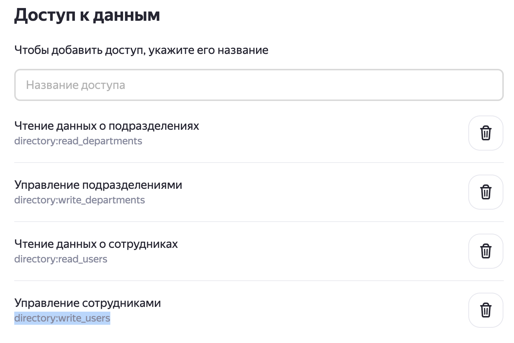

<<<<<<< HEAD
[Описание модуля](https://ya.ru)

=======
# Описание модуля 
При выполнении задач управления настройками ораганизации Яндекс 360 администратор часто сталкивается с необходимость выполнять часть настроек через вызовы HTTP API функций с соответствующими параметрами (ссылка на документацию доступных API вызовов - [API Яндекс 360 для бизнеса](https://yandex.ru/dev/api360/))

Данный модуль преданазначен для автоматизации некоторых сложных задач, которые можно выполнить только через API запросы.
В модуле используются наработки моих коллег архитекторов Яндекс 360, которые в разное время создавали свои скрипты под выделенные задачи.
Возможности модуля предполагается со временем расширять для того, чтобы в одном месте собрать функционал для реализации различных задач.

На текущий момент времени модуль состоит из одного запускаемого файла - `y360utils.py`, работать с которым предполагается в интерактивном режиме (при запуске показывается текстовое меню), где требуется взаимодействие с администратором, в том числе, подтверждение его соглачия на выполнение действий с организацией Яндекс 360.

## Реализованные функции модуля
Ниже представлено краткое описание текущего функционала `y360utils.py`. Более подробные сведения представлены ниже в описании.

### Запускаемый файл - *y360utils.py*
| Пункт меню | Описание |
|------------|----------|
|1. Delete all departments and create them from file.| Удаляет все подразделения из организации Яндекс 360 и создаёт новые из файла | 
|2. Update departments from file.| Сохраняет текущию структуру подразделений и добавляет новые из файла (**отсутствующие в файле подразделения не удаляются из Я360**) | 
|3. Export existing departments to file.| Сохранение текущей иерархии подразделений в файл (можно использовать для бэкапа) | 
|4. Export unused departments to file. | Поиск неиспользуемых департаментов в Я360 (в качестве основы для сравнения используется входной файл с полным и актуальным списком подразделений)|
|5. Delete unused departments.| Удаление выделенных подразделений из Я360 (используется файл со списком удаляемых подразделений)|
|6. Delete all departments.| Удаление всех подразделений из организации Я360|

## Подготовка к работе

> \[!WARNING\]  
> Далее все рекомендации по установке и настройке среды описваются для последней версии Python (протестировано на 3.12.4). Если у вас другая версия, поступайте в соответствии с вашей конфигурацией.

1. Необходимо установить исполняемую среду Python ([Download Python](https://www.python.org/downloads/))
2. (Опциоанально) Использовать виртуальную среду для работы программы. Для этого:
    * В коммандной строке установите инструмент создания виртуальной среды - `$ pip install virtualenv`
    * Переходим в каталог, где находится скрипт для запуска, и выполняем команду создания каталога для поддержки вирутальный среды Python для этого проекта - `python3 -m venv env`. Это создаст в текущем каталоге новый каталог `env` со своей служебной структурой.
    * Перед запуском скрипта необходимо активировать виртуальную среду для его выполнения. Для этого выполняем команду:
        - в MacOS, Linux - `source env/bin/activate`
        - в Windows - в каталоге `env\Scripts` есть несколько файлов:
            - `activate.ps1` - для активации через Powershell;
            - `activate.bat` - для активации через CMD.
    * После выполнения программы для выхода из вигруального окружения нужно использовать:
        * в MacOS выполнить команду `deactivate`
        * В Windows выполнить команду `env\Scripts\deactivate.bat`
4. Один раз после активации вирутальной среды выполнить установку пакетов, необходимых для работы программ - `pip install -r requirements.txt`
3. Создать OAuth токен для аутнтификации в API Яндекс 360. Токен должен содержать необходимые права для выполения операций управления ресурсами в организации Яндекс 360. Документация - [Создание приложения](https://yandex.ru/dev/id/doc/ru/register-client). Последовательность шагов для создания токена:
    * заходим на https://oauth.yandex.ru/client/new/. Аутентифицируемся от имени администратора организации Яндекс 360.
    * Заполняем поля в форме создания приложения:
        - Поле "Название вашего сервиса" - произвольное название.
        - Включаем галочку "Веб сервисы"
        - В поле `Redirect URL` вводим `https://oauth.yandex.ru/verification_code`
        - В разделе "Почта для связи" указываем свой email.
        
    * Добавляем разрешения для токена. Для этого в разделе "Доступ к данным" ищем и добавляем следующие разрешения:
        | Имя разрешения | Описание |
        |----------------|----------|
        | directory:read_departments | чтение информации о  подразделениях |
        | directory:write_departments | изменять информацию о подразделениях |
        | directory:read_users |  читать информацию о пользователях |
        | directory:write_users | изменять информацию о пользователях |
        
        
>>>>>>> 8a05c9466ec7bf5d229b4a16293472e98d5e3891
